# Simple 'Nutrition calculator'

## Introduction

As name says, this is a simple calculator to showcase simple python code.
It takes multiple nutritional values from 2 articles and sums them together.
Result prints calories, fat, carbohydrates and protein content in grams (g).
Target audience are fitness groups or people on diet that want to track their calories.
- The live link can be found here: https://nutrition-calculator-2.herokuapp.com/

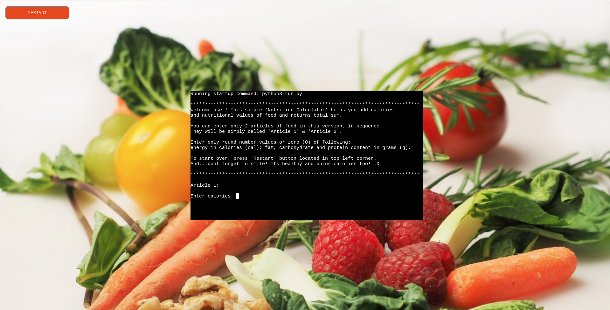

## Table of Contents
* [Introduction](#introduction)
* [User Experience Design (UX)](#user-experience-design-ux)
* [Features](#features)
* [Future Enhancements](#future-enhancements)
* [Technologies Used](#technologies-used)
* [Testing](#testing)
* [Deployment](#deployment)
* [Credits](#credits)
* [Acknowledgements](#acknowledgements)

## User Experience Design (UX)

Portfolio 3 projects main focus is to create functional pythone code. As such UX design is not of big significance, as we can see from provided mock terminal from Code Institute. It is not responsive on mobile devices and has scarce UI features for desktop too. It is barebone teminal and start button on white background as presented:

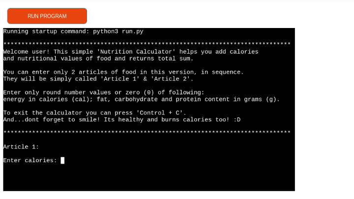

To make it more appealing and user friendly we added background picture to match the theme of project:

We centered terminal horizontally and vertically:

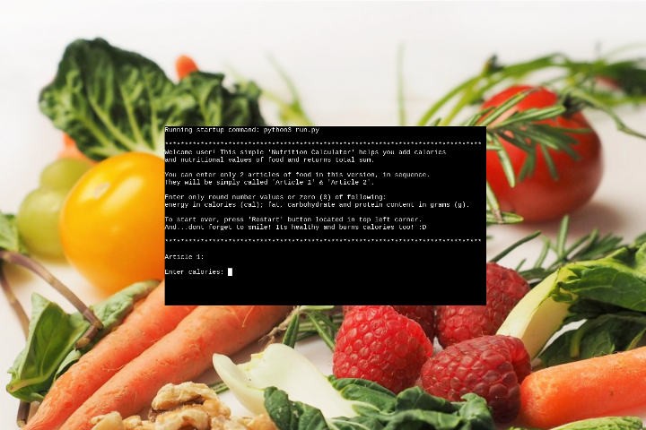
 
And we also changed button text to 'Restart':

## Features

Currently program is designed to take inputs from 2 articles, one after another and provide total result.

- Article 1:

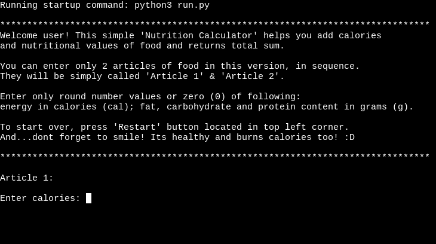

- Article 2:

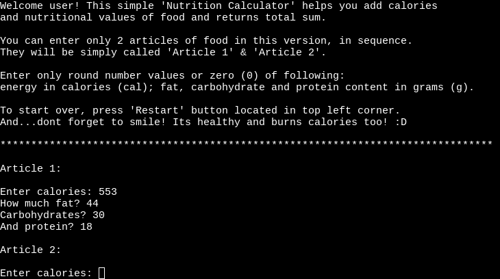

- Result:

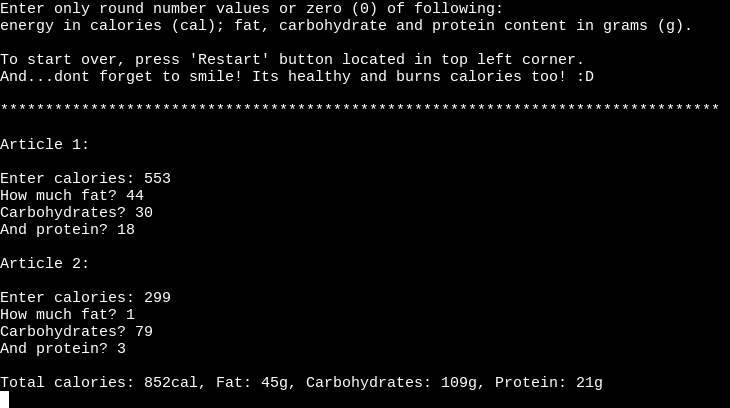

Input is limited only to round numbers so far and it doesnt accept letters. If we enter any of those we get an error message:

- Decimal numbers:

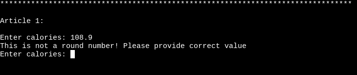

- Letters:

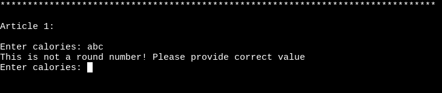

## Future Enhancements

- Make code that can take input for 'n' number of articles. Which means calculating more than just 2 inputs.
- After second input provide option to continue adding articles or calculate current inputs.
- Extend functionality to be able to input decimal numbers too.
- Make it able to restart calculator from terminal, not just with mockup button.
- Possibility for an mobile app.

## Technologies Used

- [HTML5](https://en.wikipedia.org/wiki/HTML5)
- [CSS3](https://en.wikipedia.org/wiki/CSS)
- [Python](https://www.python.org/) 
- [GitHub](https://github.com/)
- [GitPod](https://www.gitpod.io/)
- [Heroku](https://www.heroku.com)
- [Chrome DevTools](https://developer.chrome.com/docs/devtools/)

## Testing

Project was constantly manually tested while coding on Google Chrome. Alternatively we used Brave browser. Program performed correct as expected.

### PEP 8

Python code was manually tested for code validation at [PEP8 online.](http://pep8online.com)
Project passed validator testing for all PEP8 requirements. 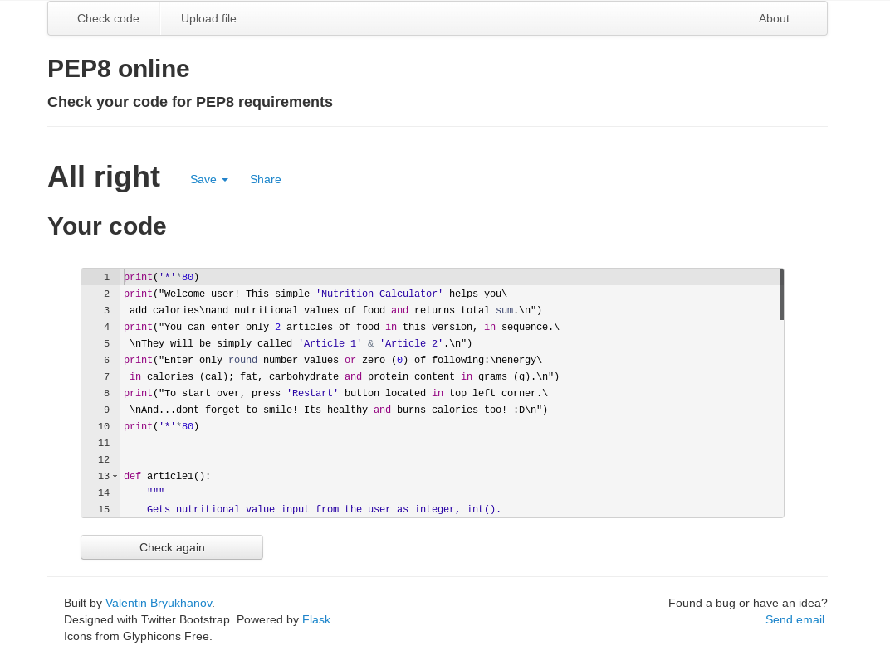

### Lighthouse

We used inbuilt Chrome DevTools testing tool called 'Lighthouse' to test webpage performance, accesibility, best practices and SEO. Project scored high numbers in first two categories while other two still have space for improvement.

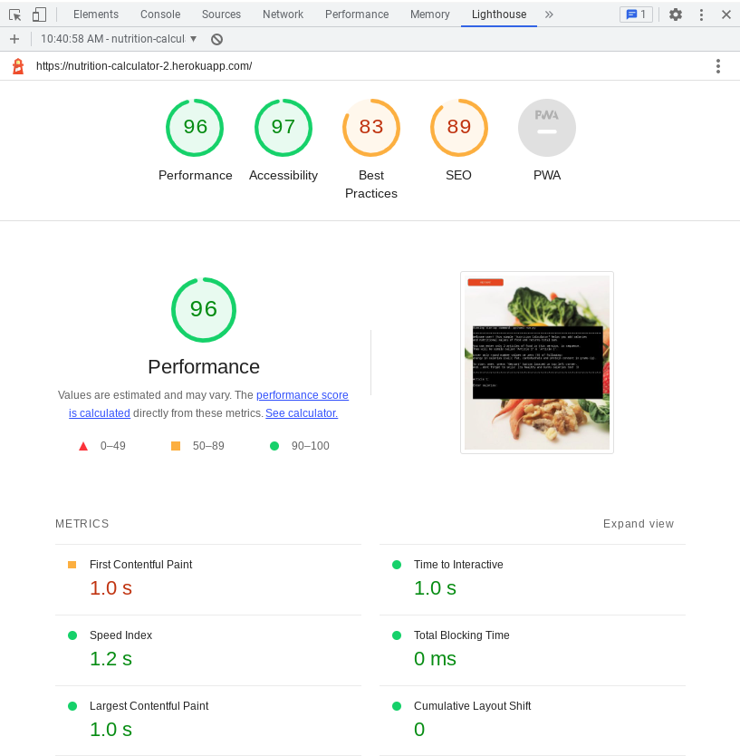

### Bugs

- 'Control + C' command doesn't work properly. Instead of exiting calculator it freezes terminal. For now user can use 'Restart' button for that. To be fixed in future and implemented in terminal.

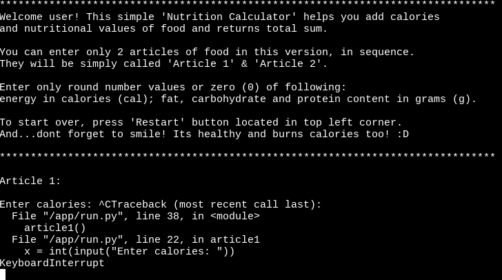

## Deployment

To deploy third portfolio project, the Python command-line project; we used Code Institute student template from GitHub that enables the application to be properly viewed on Heroku using a mock terminal.

### GitHub

[GitHub](https://github.com/), Inc., is an Internet hosting service for software development and version control using Git. It provides the distributed version control of Git plus access control, bug tracking, software feature requests, task management, continuous integration, and wikis for every project. - Wikipedia

- Code Institute [Python Essentials Template](https://github.com/Code-Institute-Org/python-essentials-template).

### Heroku

[Heroku](https://www.heroku.com) is a platform designed to host dynamic websites. While Github pages is a great hosting platform for  
projects built entirely with front end languages  like HTML, CSS and JavaScript, it's not built  
to handle back end languages like Python, which  is why we're using Heroku for this deployment.

- The live link can be found here: https://nutrition-calculator-2.herokuapp.com/

## Credits

Alongside Code institute material and LMS i used following pages for general learning and understanding of python:
- [W3Schools](https://www.w3schools.com/)
- [YouTube](https://www.youtube.com/) channels:
  - [Freecodecamp](https://www.youtube.com/c/Freecodecamp)
    - Video tutorial: [Learn Python - Full Course for Beginners](https://www.youtube.com/watch?v=rfscVS0vtbw)
  - [Mike Dane](https://www.youtube.com/c/GiraffeAcademy)

For more specific help with building project i found Stack Overflow blog very helpful:
- [Stack Overflow](https://stackoverflow.com/)
  - Tips and help with inputs: [How to get N inputs from user in python](https://stackoverflow.com/questions/30786513/how-to-get-n-inputs-from-user-in-python)
  - Summing values, zip function..: [Python sum values from multiple lists](https://stackoverflow.com/questions/52703442/python-sum-values-from-multiple-lists-more-than-two)
  - Centering terminal on page: [Center a DIV horizontally and vertically](https://stackoverflow.com/questions/14123999/center-a-div-horizontally-and-vertically)

Webpage background image is hosted by [PxHere](https://pxhere.com/en/photo/669281)
 

## Acknowledgements

Big thanks to my mentor Jack Wachira who was trully put to test with my last minute projects and deadlines. :D (btw., he passed with highest grades! ;)
He troubleshoot not just with my project but with life situations and personality, and showed what programming actually is. It is a mindset. A mindset that you can apply to anything in life. That is by biggest take from this, for which im very grateful.

CI slack community, what to say..always there to help and motivate eachother, its one big geek family that i grew fond of.

Tutor support helping from different time zones or opposite sides of the world at late evenings or early mornings haha :D

All of mentioned made me appreciate and love this experience with CI and programming. I actually start to see myself as programmer and feel comfortable with it. And this is very big change.

Many many thanks.. :)